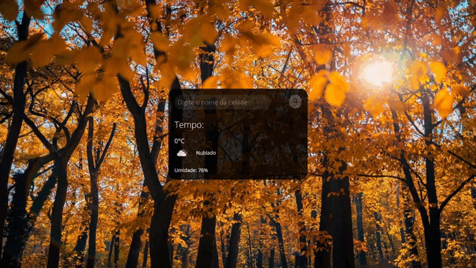

<h1 align="center">App Previsão do Tempo </h1>

  <a href="#-tecnologias">Tecnologias</a>&nbsp;&nbsp;&nbsp;|&nbsp;&nbsp;&nbsp;
  <a href="#-projeto">Projeto</a>&nbsp;&nbsp;&nbsp;|&nbsp;&nbsp;&nbsp;
  <a href="#memo-licença">Licença</a>

 

  

## 🚀 Tecnologias

Esse projeto foi desenvolvido com as seguintes tecnologias:

- HTML e CSS
- JavaScript
- API OpenWeather
- Git e Github

## 💻 Projeto

Este projeto é um aplicativo de previsão do tempo, usando uma das API's do OpenWeather, seu objetivo é achar a temperatura de qualquer cidade digitada no seu campo de pesquisa, independente do país. Mostrando temperatura, humidade e céu. 

